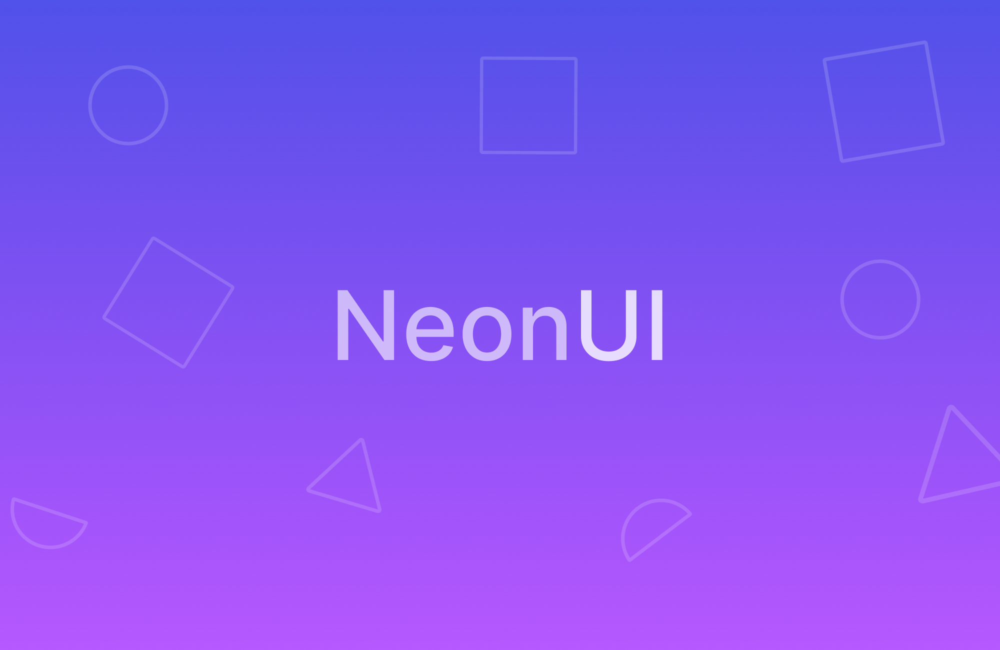

> 🔴  **This project is discontinued. Check out [MonoUI](https://github.com/Dots-Studio/MonoUI) for a replacement made with Web Components, more powerful styling and other great new things.**

# NeonUI

NeonUI is a lightweight, clean & modern UI library for the web.
## Quick start guide
1. Download NeonUI from (https://github.com/Dots-Studio/NeonUI/releases)
2. Copy it into the folder of your project.
3. Add a &lt;/link&gt; to the .css file and one to the .js file.
## Docs
We're working on the documentation. For a quick look of most controls in NeonUI, check out https://github.com/Dots-Studio/NeonUIGallery.
## Styling
Most NeonUI controls are using variables for their values.
The 4 main variables that you'll want to tweak are:
- --AccentColor (we'll generate a pallete based on it for you)
- --RoundCorner...
- --HeadingFont & --Font  
In order to customize them:
1. Create a new .css file and link it in your .html file
2. Add the ::Root pseudo-class
3. Add your new variable values to the ::Root
## Contributing
~~You can contribute at any time by creating issues and pull requests.~~
## Need help?
You can get more help for NeonUI in our [Discord Server](https://discord.gg/ayD26c9vT9).
